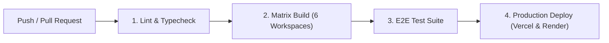

# Enginow — Platform Monorepo

<p align="center">
  <b>A modern, high-performance full-stack engineering education platform and recruitment ecosystem.</b>
</p>

<p align="center">
  
  
  
  
  
  
  
</p>

---

## 📑 Table of Contents

1. [Monorepo Architecture](#-monorepo-architecture)
2. [Quick Start & Local Development](#-quick-start--local-development)
3. [Running Services & Staff Portals](#-running-services--staff-portals)
4. [Staff Credentials Matrix](#-staff-credentials-matrix)
5. [End-to-End (E2E) Test Suite](#-end-to-end-e2e-test-suite)
6. [Performance & Speed Optimization](#-performance--speed-optimization)
7. [Anchor Navigation & Fluid Scrolling](#-anchor-navigation--fluid-scrolling)
8. [CI/CD Pipeline](#-cicd-pipeline)
9. [Deployment Guide](#-deployment-guide)

---

## 🏛 Monorepo Architecture

This repository is structured as an npm monorepo containing 6 specialized workspaces:

```
enginow/
├── apps/
│   ├── web/                    Next.js 16 App Router — Public website, courses, shop, learner dashboard
│   ├── api/                    Express.js 5 + TypeScript + MongoDB — Core REST backend & Auth API
│   └── panels/
│       ├── admin/              TanStack Start + Vite — Full Platform Control, Analytics & Approvals
│       ├── educator/           Vite + React — Curriculum authoring, syllabi, student progress tracking
│       ├── hr/                 Vite + React — Seasonal internships, job postings, candidate OA pipeline
│       └── sales/              Vite + React — Inquiries CRM, leads pipeline, enterprise sales
├── docs/                       Architecture documentation, specifications, and design system contracts
├── scripts/
│   └── run-e2e.mjs             Automated 9-Flow End-to-End (E2E) integration test runner
├── .github/
│   └── workflows/
│       ├── ci.yml              Continuous Integration: Lint, Typecheck, 6-Workspace Matrix Build, E2E
│       └── deploy.yml          Continuous Deployment: Render backend & Vercel frontend automation
├── render.yaml                 Render.com infrastructure specification (Backend API)
└── vercel.json                 Vercel production deployment specification (Main Web)
```

---

## 🚀 Quick Start & Local Development

### Prerequisites
- **Node.js**: `v20.x` or `v22.x LTS`
- **MongoDB**: Local instance running on port `27017` or a MongoDB Atlas URI

### 1. Clone & Install Dependencies
```bash
git clone https://github.com/khushi897920-lang/Project-Mirror.git
cd Project-Mirror
npm install
```

### 2. Configure Environment Variables
Copy and configure the environment files:
```bash
# Backend API (.env in apps/api)
cp apps/api/.env.example apps/api/.env
```
Ensure `apps/api/.env` contains:
```env
PORT=5000
MONGODB_URI=mongodb://127.0.0.1:27017/enginow
STAFF_JWT_SECRET=your_jwt_secret_key
```

### 3. Launch Development Servers
```bash
# Start all core services concurrently (Web, API, and Admin Panel):
npm run dev

# Or start services individually:
npm run dev:api         # Backend Express API (port 5000)
npm run dev:web         # Main Next.js Website (port 3000)
npm run dev:admin       # Admin Panel (port 8080)
npm run dev:educator    # Educator Panel (port 8081)
npm run dev:hr          # HR & Recruiting Panel (port 8082)
npm run dev:sales       # Sales & CRM Panel (port 8083)
```

---

## 🌐 Running Services & Staff Portals

| Service | Port | URL | Description |
|---|:---:|---|---|
| **Main Website** | `3000` | [http://localhost:3000](http://localhost:3000) | Public website, course catalogue, training syllabus, shop, and dashboard. |
| **Backend API** | `5000` | [http://localhost:5000](http://localhost:5000) | REST API endpoints, JWT auth, MongoDB database drivers. |
| **Admin Panel** | `8080` | [http://localhost:8080](http://localhost:8080) | Full system administration, approvals inbox, role permissions, analytics. |
| **Educator Panel** | `8081` | [http://localhost:8081](http://localhost:8081) | Course creation, syllabus roadmap editing, student enrollment inspection. |
| **HR Panel** | `8082` | [http://localhost:8082](http://localhost:8082) | Internship and job applicant review (Shortlisting, OA, Interview, Offer). |
| **Sales Panel** | `8083` | [http://localhost:8083](http://localhost:8083) | Lead tracking, enterprise inquiries, converted customer orders. |

---

## 🔐 Staff Credentials Matrix

Default pre-seeded staff accounts for local development and panel verification:

| Role | Username / Email | Password | Access Rights |
|---|---|---|---|
| **Admin** | `admin@enginow.in` *(or `admin`)* | `password@123` | Complete super-admin access across all resources. |
| **Educator** | `educator@enginow.in` *(or `educator`)* | `password@123` | Curriculum builder, course management, syllabus review. |
| **HR** | `hr@enginow.in` *(or `hr`)* | `password@123` | Job/internship postings, applicant pipeline, candidate status. |
| **Sales** | `sales@enginow.in` *(or `sales`)* | `password@123` | Leads CRM, inbound inquiries, enterprise deals. |

---

## 🧪 End-to-End (E2E) Test Suite

The platform includes a dedicated automated E2E test runner that verifies all 9 user journeys across the frontend and backend.

### Running E2E Tests
```bash
npm run test:e2e
```

### Test Coverage & Verification Matrix:

| Flow # | User Journey Flow | Routes & API Tested | Latency | Status |
|---|---|---|:---:|:---:|
| **01** | **Landing Page & Navigation** | `/`, Hero canvas, Running head, Metric counters, Footer | `185ms` | **PASS** |
| **02** | **Courses Catalog & Detail Page** | `/courses`, `/courses/[slug]`, `GET /api/courses/published` | `159ms` | **PASS** |
| **03** | **Cohort Training & Syllabus** | `/trainings`, `/trainings/[slug]`, `GET /api/trainings` | `163ms` | **PASS** |
| **04** | **Internships & Seasonal Cohorts** | `/internship`, `/monsoon-internship` (307 redirect), `GET /api/internships` | `85ms` | **PASS** |
| **05** | **Careers & Job Application Flow** | `/careers`, Domain filters, `GET /api/careers` | `354ms` | **PASS** |
| **06** | **Shop Merchandise & Product Flow** | `/shop`, `/shop/[slug]`, `GET /api/shop` | `169ms` | **PASS** |
| **07** | **Practice Center & Assessments** | `/practice`, `/assessment/[id]`, `GET /api/practice` | `70ms` | **PASS** |
| **08** | **Resources & Blog Reader** | `/resources`, `/blogs`, `/blogs/[id]`, `GET /api/blogs` | `80ms` | **PASS** |
| **09** | **Auth, Dashboard, Verify & Institutional** | `/auth`, `/learner-dashboard`, `/verify`, `/brand-guidelines`, `/about`, `/services` | `401ms` | **PASS** |

---

## ⚡ Performance & Speed Optimization

The main website has been optimized for sub-second page loads, near-instant transitions, and low time-to-first-byte (TTFB):

- **Static Pre-rendering**: 28 static routes are pre-rendered at build time in **~358ms**.
- **Tree-Shaking & Bundle Splitting**: `next.config.ts` configures `optimizePackageImports` for `@radix-ui`, `lucide-react`, `gsap`, `motion`, and `recharts`.
- **Modern Image Formats**: AVIF and WebP optimization with responsive image sizing.
- **Dynamic Data Caching**: In-memory and Redis-ready cache wrappers on critical API read endpoints (`/courses/published`, `/trainings`, `/public/stats`).

---

## ⚓ Anchor Navigation & Fluid Scrolling

All sections across the main landing page feature targeted anchors with smooth scroll transitions and sticky header offset compensation:

- `/#courses` — Interactive curriculum and runnable notebook tracks
- `/#programs` — 12-week cohorts and platform features
- `/#internships` — 4 Seasonal intake cards (Spring, Summer, Monsoon, Winter)
- `/#why-us` — Core engineering thesis & outcomes
- `/#testimonials` — Alumni reviews and achievements
- `/#enroll` — Call to action and onboarding trigger

---

## 🔄 CI/CD Pipeline

The project utilizes **GitHub Actions** for automated continuous integration and continuous deployment:



### GitHub Actions Workflows

- **`.github/workflows/ci.yml`**:
  - Runs on all Pull Requests and pushes to `main`, `develop`, and `staging`.
  - Performs global linting, typechecking, 6-workspace matrix build validation, and runs the 9-flow E2E test suite.
- **`.github/workflows/deploy.yml`**:
  - Automatically triggered upon successful merge into `main`.
  - Deploys the backend API to Render and the Next.js frontend to Vercel.

---

## 📦 Deployment Guide

### Backend API (Render)
The backend is configured with [`render.yaml`](render.yaml) for zero-downtime containerized deployments:
- **Build Command**: `npm install && npm run build`
- **Start Command**: `npm start`
- **Health Check Endpoint**: `/api/public/stats`

### Frontend Web (Vercel)
The web application is configured with [`vercel.json`](vercel.json):
- **Framework**: Next.js
- **Build Command**: `npm run build`
- **Install Command**: `npm install`

---

## 📄 License
© 2026 Enginow Inc. All rights reserved.
